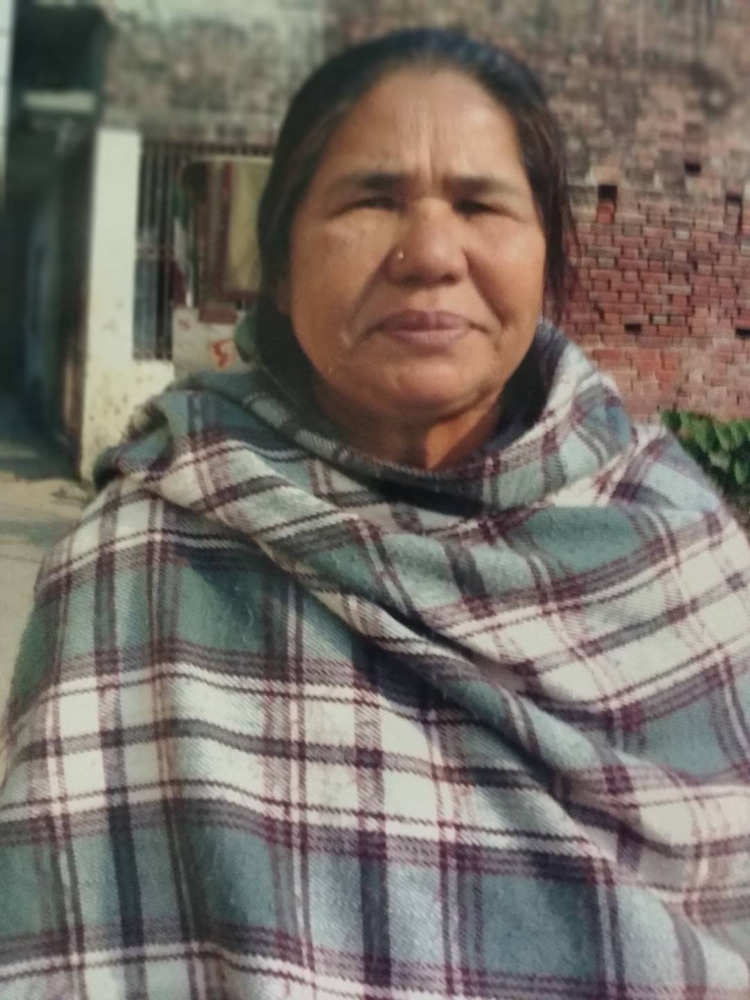

# 🚀 Project Gehen

Welcome to **Project Gehen**! This project is designed for diagnosing dementia using brain MRI scans that leverages machine learning algorithms to analyze MRI scans and predict the presence and type of dementia.

## Why Project Gehen?

**A Tribute to My Grandmother**



Project Gehen is a deeply personal endeavor born out of the heart-wrenching experience of losing my grandmother, Aama, to Alzheimer's disease. The disease progressed rapidly, taking her from us on ***March 08, 2023***. The pain of witnessing her gradual decline was unbearable, compounded by the realization that early detection could have made a significant difference.

This project is a testament to her memory and a commitment to prevent others from suffering the same fate. The research I conducted during my fourth semester ignited a passion for machine learning and neurotechnology, fields I believe hold the key to early Alzheimer's detection and treatment. 

Through Project Gehen, I aim to contribute to the development of tools and technologies that can help in the early diagnosis and management of Alzheimer's disease. My ultimate goal is to create a world where families are not forced to endure the same heartbreak that I experienced. Therefore, **Project Gehen**, named after my `aama`, **Mrs. Gehendra Devi Paudel.**` 

## 📚 Table of Contents

- [About the Project](#about-the-project)
- [Key Objectives](#Key-Objectives)
- [Installation](#installation)
- [Usage](#usage)
- [Contributing](#contributing)
- [Contact](#contact)

## 🛠️ About the Project

**Project Gehen** focuses on developing an advanced system for dementia analysis using brain imaging data. Dementia is a common
neurodegenerative condition affecting millions worldwide. Early and accurate diagnosis is essential for timely intervention and improved patient outcomes.

## 🎯 Key Objectives

- Develop an AI-powered platform for dementia analysis using neuroimaging techniques, enabling the classification of MRI scans into distinct dementia stages: Very Mild Demented, Mild Demented, Non-Demented, and Moderate Demented.

- Create a user-friendly web application that allows medical professionals to upload MRI images and receive real-time predictions for dementia stages, providing an efficient and accessible tool for early diagnosis.

- Contribute to the advancement of dementia research and medical care by providin a non-invasive and reliable system that aids in personalized treatment plans and early intervention, ultimately improving the quality of life for individuals affected by dementia.


## 🛠 Installation

Follow these steps to set up **Project Gehen** on your local machine:

### 1. **Clone the Repository**

First, clone the repository to your local machine:

```bash
git clone https://github.com/Banshaj-Paudel/Project-Gehen.git
cd Project-Gehen
```

### 2. **Set Up the SQL Database**

You need to set up the SQL database using the `gehen.sql` file:

1. Open **XAMPP** and start **MySQL**.
2. Open **phpMyAdmin** in your browser (usually at `http://localhost/phpmyadmin`).
3. Create a new database (e.g., `gehen_db`).
4. Import the `gehen.sql` file located in the `backend` folder:
   - Go to the **Import** tab in phpMyAdmin.
   - Select the `gehen.sql` file from your local repository (`backend/gehen.sql`).
   - Click **Go** to import the database.

## 🚀 Usage

To start using **Project Gehen**, follow these steps:

### 1. **Run the Model Flask Application**

Now, navigate to the `model` folder and run the Flask application:

```bash
cd model
python app.py
```

> **Note:** Ensure you have all the required dependencies installed (e.g., Flask).


### 2. **Run the Backend Flask Application**

Once the model Flask application is running, you need to start the backend Flask application:

1. Open a new terminal window.
2. Navigate to the `backend` folder:
   ```bash
   cd ../backend
   ```
3. Run the Flask application:
   ```bash
   python app.py
   ```

### 3. **Access the Application**

After starting both Flask applications, you can access the website by visiting `http://localhost:5000` in your web browser.

## 🤝 Contributing

Contributions are what make the open-source community such an amazing place to learn, inspire, and create. Any contributions you make are **greatly appreciated**.

1. Fork the Project
2. Create your Feature Branch (`git checkout -b feature/AmazingFeature`)
3. Commit your Changes (`git commit -m 'Add some AmazingFeature'`)
4. Push to the Branch (`git push origin feature/AmazingFeature`)
5. Open a Pull Request

## 📬 Contact

Banshaj Paudel - [banshajpaudel5010@gmail.com](mailto:banshajpaudel5010@gmail.com)

Project Link: [https://github.com/Banshaj-Paudel/Project-Gehen](https://github.com/Banshaj-Paudel/Project-Gehen)


> 🌟 Don't forget to give this project a star if you found it useful!